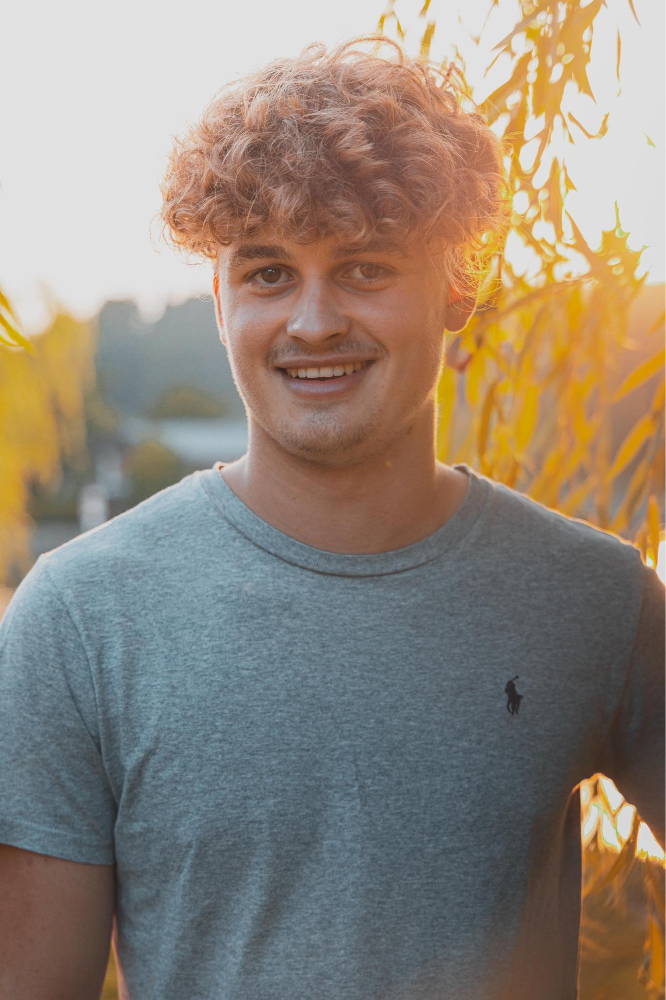
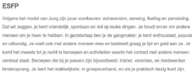
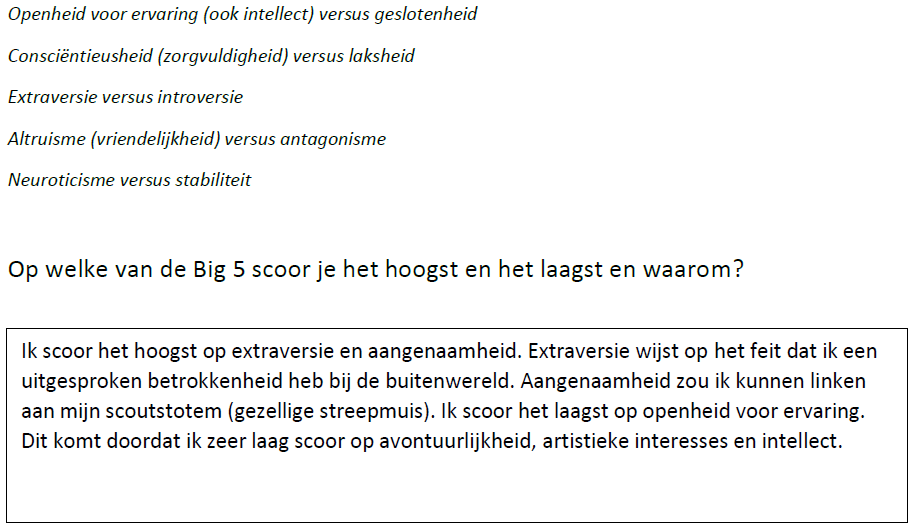
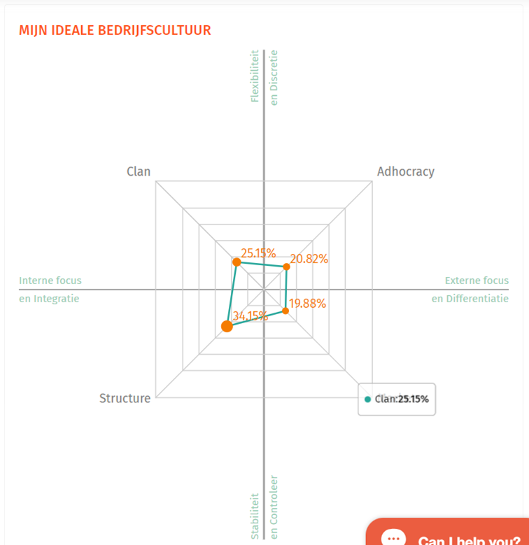
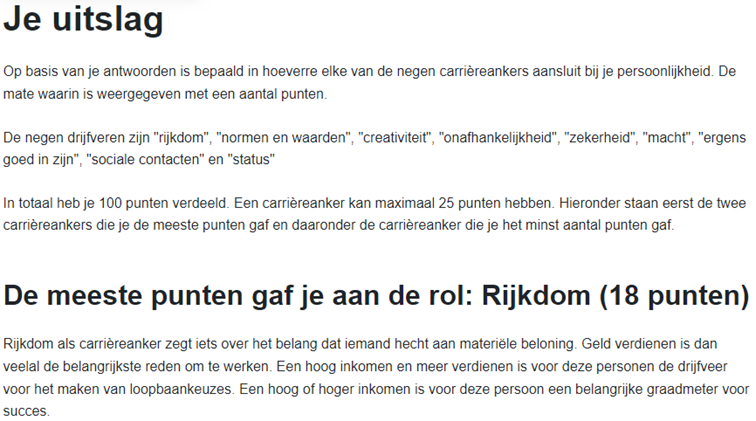
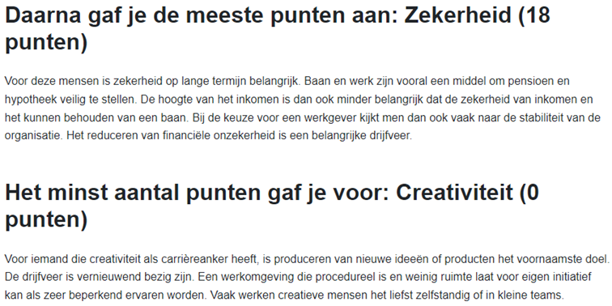
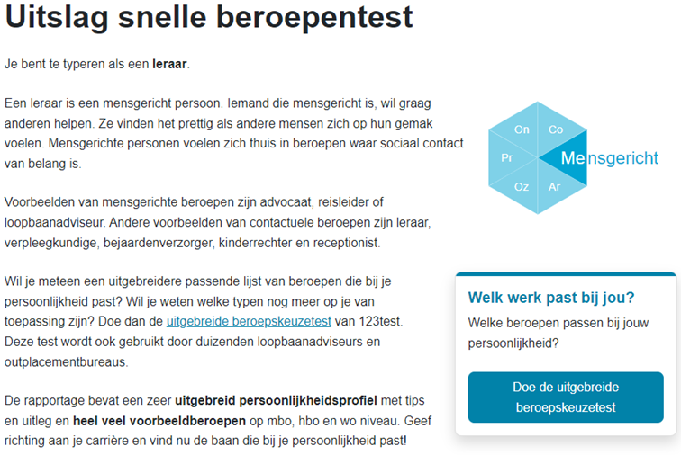
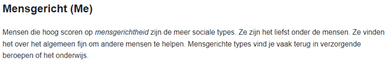

# Mijn Portfolio

## Persoonlijke Informatie

Naam: Senne Ranson

### Over Mij

Ik ben Senne, een 20-jarige student toegepaste informatica aan de Hogeschool Gent, met een ongeëvenaarde passie voor IT. Ik vind het fascinerend om de wereld van kunstmatige intelligentie en data-analyse te verkennen en te ontdekken. Naast mijn studie ben ik een fervent voetballer bij KDC Ruddervoorde, waar ik mijn energie kan kwijt en geniet van de teamspirit op het veld. Ook ben ik trots om mijn kennis en ervaring te delen als leider bij de scouts Ruddervoorde, waar ik anderen kan inspireren en begeleiden. Mijn specialisatie ligt in mainframetechnologieën, wat ook mijn afstudeerrichting is. Dit gebied intrigeert me en ik streef ernaar om mijn vaardigheden hierin verder te ontwikkelen en te excelleren. Ik ambieer een boeiende en uitdagende baan bij een bedrijf waarvan het bedrijfsonderwerp mij echt aanspreekt. Het idee om mijn passie voor IT te combineren met een stimulerende werkomgeving waar ik mijn vaardigheden kan inzetten en verder kan ontwikkelen, motiveert mij enorm. Ik ben ervan overtuigd dat ik met mijn enthousiasme, doorzettingsvermogen en leergierigheid een waardevolle aanwinst kan zijn voor elk bedrijf.

### Testresultaten

- MBTI

- BIG 5-test

- My Career Companion Test

- Schein-test

- Beroepentest

## Curriculum Vitae

Download [hier](content/Senne%20Ranson.pdf) mijn CV.

### Hobby's en Activiteiten

- [Hobby 1]
- [Hobby 2]
- [Buitenschoolse activiteit 1]
- [Buitenschoolse activiteit 2]

## Realisaties

### Projecten

- [Project 1]
- [Project 2]
- ...

### Stage

- [Stagebedrijf / -instelling]
- [Beschrijving stage]

### Bachelorproef

- [Onderwerp van je bachelorproef]
- [Korte beschrijving]

### Eigen Realisaties

- [Eigen realisatie 1]
- [Eigen realisatie 2]
- ...

### Ervaringen

#### Huidige Technische Skills

- [Skill 1]
- [Skill 2]
- ...

#### Gewenste Ervaringen

- [Gewenste ervaring op korte termijn]
- [Gewenste ervaring op lange termijn]

## Talen

Dit portfolio is beschikbaar in de volgende talen:

- [Nederlands]
- [Engels]
- [Andere talen, indien van toepassing]
