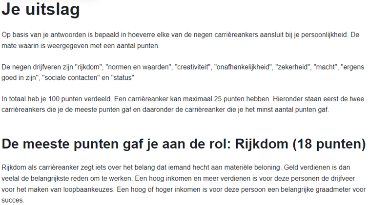
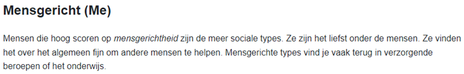

# My Portfolio

## Personal Information

Name: Senne Ranson

### About Me

I am Senne, a 20-year-old student of applied computer science at Hogeschool Gent, with an unparalleled passion for IT. I find it fascinating to explore and discover the world of artificial intelligence and data analysis. Besides my studies, I am an avid football player at KDC Ruddervoorde, where I can release my energy and enjoy the team spirit on the pitch. I am also proud to share my knowledge and experience as a leader at Ruddervoorde Scouts, where I can inspire and guide others. My specialization lies in mainframe technologies, which is also my major. This area intrigues me, and I strive to further develop and excel in my skills. I aspire to an exciting and challenging job at a company whose business topic really appeals to me. The idea of combining my passion for IT with a stimulating work environment where I can use and further develop my skills motivates me greatly. I am convinced that with my enthusiasm, perseverance, and eagerness to learn, I can be a valuable asset to any company.

### Test Results

- MBTI

- BIG 5-test

- My Career Companion Test

- Schein-test

- Beroepentest

## Curriculum Vitae

Download my CV [here](content/Senne%20Ranson.pdf).

### Hobbies and Activities

- Football at KDC Ruddervoorde
- Leadership at Scouts Ruddervoorde

## Achievements

### Projects

- Implemented board game Zatre in Java with JavaFX GUI (2021-2022)
- Implemented machine learning model in Python for human or robotic user recognition (2022-2023)
- Data engineering project in Python for web scraping airlines and analyzing with Power BI and Python library Pandas (2022-2023)

### Internship

- Company: Belfius Bank & Verzekeringen
- Description: During my internship, I delved into the daily operations of a Db2v12 for z/OS database administrator. One of the tasks of a database administrator is monitoring and performance tuning of Db2v12 for z/OS databases. Additionally, scripting with JCL, REXX, Python was involved, and I explored working with Db2 for z/OS REST services. I developed a simple UI to quickly retrieve information about a specific database (e.g., How many columns does table x contain? Is table y partitioned? If so, how many members does it contain?) Lastly, I also gained insight into the workings of Microsoft Azure data-related products within the team, such as Azure SQL database and Azure Synapse Analytics.

### Bachelor Thesis

- Subject: Optimization of database management for Belfius Data Platform Team: An agile transformation according to DevOps and CI/CD.
- [Short description](content/RansonSenne-BPvoorstel.pdf)

### Personal Achievements

- IBM Mainframe Systems Operator Level I Certificate 2.5 (V2) achieved
- IBM Z Xplore concepts, advanced, and extended badges achieved
- Microsoft Azure DevOps training completed

### Experiences

#### Current Technical Skills

- Communication within a professional context
- Planning and organization
- Problem-solving
- Teamwork
- Independent work
- Programming languages: Java, Python, SQL, JavaScript, C++
- Mainframe technologies: Db2, CICS, z/OS, JCL, REXX, COBOL, VSAM, ISPF, SDSF, TSO
- Data analysis: Power BI, Pandas, NumPy, Matplotlib
- Machine learning: scikit-learn
- Operating systems: Windows, Linux
- Microsoft Azure: Azure SQL database, DevOps
- Agile methodology
- CI/CD
- REST services
- Git
- Docker
- Virtualization: VirtualBox
- Kafka, Spark, Hadoop

#### Desired Experiences

- Desired short-term experience:

  - Gain relevant work experience
  - Learn new technologies
  - Collaborate with a team
  - Receive and incorporate feedback
  - Learn from experienced colleagues

- [Desired long-term experience]
  - Career advancement opportunities
  - Specialize in a specific domain
  - Lead projects
  - Share knowledge with colleagues

## Languages

This portfolio is available in the following languages:

- [Dutch](Portfolio.md)
- [English](Portfolio_eng.md)
